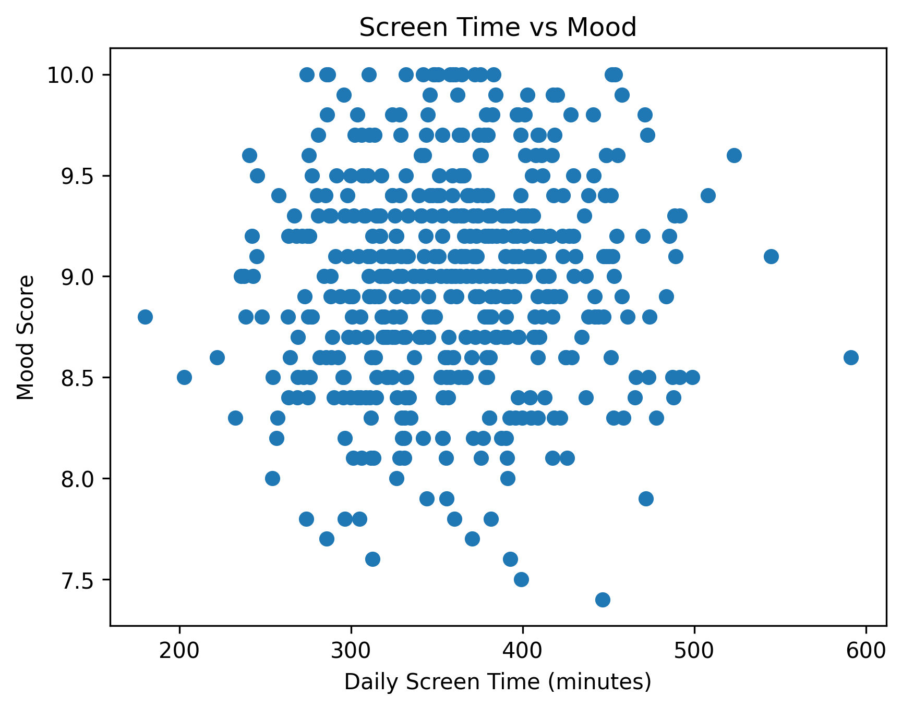
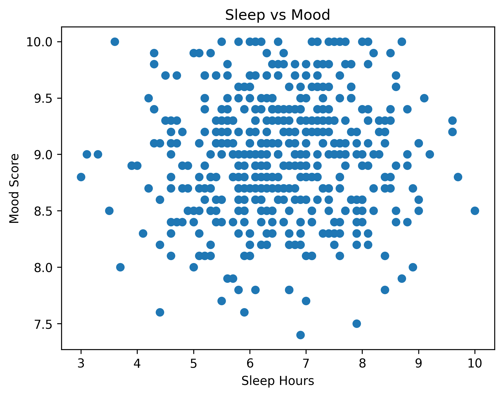
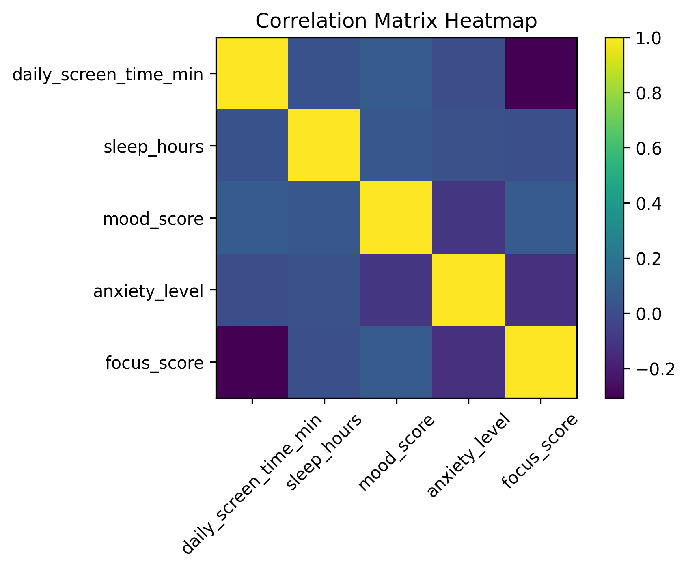

# Digital Behavior and Mental Health Analysis

## Overview
This project explores how digital behavior patterns (such as screen time and sleep) relate to mental health indicators including mood scores.

The goal is to demonstrate how behavioral data can be analyzed using Python to identify patterns that may inform digital wellbeing interventions.

---

## Dataset
Mental health digital behavior dataset containing variables such as:

- daily_screen_time_min  
- sleep_hours  
- mood_score  
- anxiety_level  
- focus_score  

---

## Tools Used
- Python  
- pandas  
- matplotlib  

---

## Key Analyses

### 1. Screen Time vs Mood
A scatterplot was created to examine the relationship between daily screen time and mood scores.

**Behavioral insight:**  
Higher screen time may be associated with lower mood in some individuals, potentially reflecting digital fatigue, displacement of restorative activities, or overstimulation.

---

### 2. Sleep vs Mood
A scatterplot was generated to explore the relationship between sleep duration and mood.

**Behavioral insight:**  
Sleep duration appears positively related to mood, which aligns with established research on sleep and emotional regulation.

---

## Why This Matters
Understanding how everyday digital behaviors relate to mental health can help inform:

- digital wellbeing tools  
- behavioral interventions  
- early risk detection systems  
- user-centered mental health technology  

This project demonstrates foundational skills in behavioral data analysis using Python.

## 📊 Visualizations

### Screen Time vs Mood

### Sleep vs Mood

### Correlation Matrix Heatmap

## 🔍 Key Insights

- Screen time shows a weak relationship with mood in this dataset.
- Sleep hours appear slightly positively associated with mood scores.
- Anxiety level shows a negative relationship with mood.
- The logistic regression model achieved ~58% accuracy, suggesting limited predictive power with the current features.

## 🧠 Future Improvements

- Add more behavioral features
- Try advanced models (Random Forest, XGBoost)
- Perform feature engineering
- Increase dataset size
